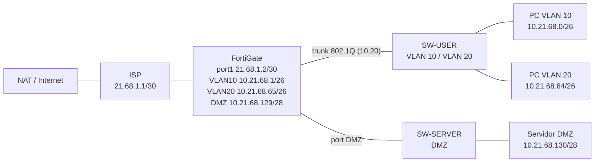
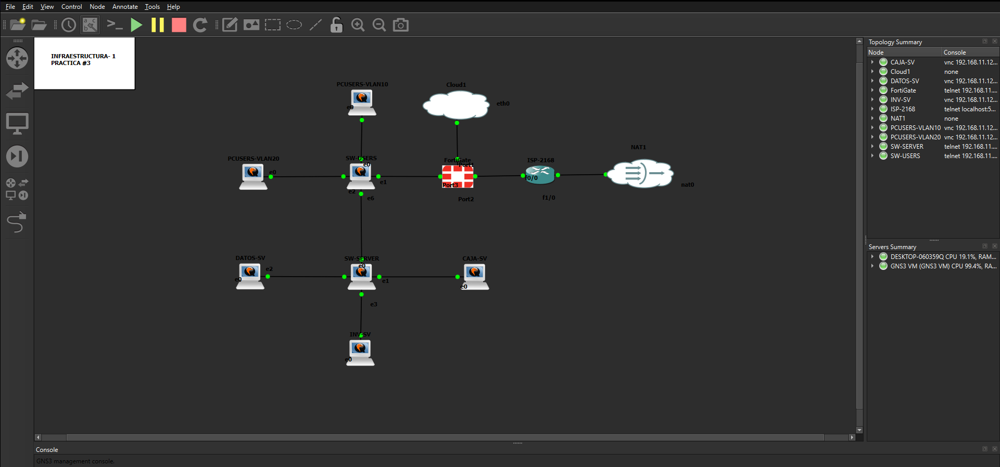

# Práctica #3 — Infraestructura #1: Segmentación con FortiGate (VLANs, DMZ y políticas de seguridad)

**Asignatura:** Seguridad de Redes
**Estudiante:** [Nombre y apellido]
**Matrícula:** [AAAA-2168]

---

Video: <https://youtu.be/7FMHyyI-_Ks>

## 1. Objetivo

Montar en GNS3 una red segmentada con un **FortiGate** como firewall central, separando usuarios (VLAN 10 y VLAN 20) y servidores (DMZ), y aplicando políticas que controlen qué tráfico puede pasar entre zonas y hacia Internet. Además se protege el acceso a los switches con **port-security**.

Lo que se quiere demostrar:

- Los usuarios de la **VLAN 10** no pueden acceder por **HTTP** ni **SSH** al servidor (bloqueo explícito en el FortiGate).
- Los usuarios de la **VLAN 20** sí pueden entrar por **SSH** al servidor.
- Desde la **DMZ** no se puede hacer ping hacia la red de usuarios ni hacia Internet (Google), pero el servidor sí puede actualizarse (`sudo apt update`).
- La política de salida a Internet registra y bloquea las violaciones.
- Port-security activo en 3 interfaces de los switches.

---

## 2. Topología

> Ajustar nombres de interfaces y equipos a los de tu `Topologia.png`.





---

## 3. Direccionamiento (basado en la matrícula 2168)

Se usan los bloques `21.68.x.x` para el enlace público y `10.21.68.x` para las redes internas.

| Red / Enlace      | Segmento          | Gateway / Equipo                | Rango de hosts          |
| ----------------- | ----------------- | ------------------------------- | ----------------------- |
| WAN ISP ↔ FG      | `21.68.1.0/30`    | ISP `.1` / FortiGate `.2`       | —                       |
| VLAN 10 (users)   | `10.21.68.0/26`   | FortiGate `10.21.68.1`          | `.2 – .62` (DHCP)       |
| VLAN 20 (users)   | `10.21.68.64/26`  | FortiGate `10.21.68.65`         | `.66 – .126` (DHCP)     |
| DMZ (servidores)  | `10.21.68.128/28` | FortiGate `10.21.68.129`        | Servidor `10.21.68.130` |


---

## 4. Herramientas

- GNS3
- FortiGate VM
- Cisco IOS (ISP) y switches Cisco (`SW-USER`, `SW-SERVER`)
- Ubuntu (clientes y servidor)

---

## 5. Configuración

Los archivos completos están en [`configs/`](configs):

| Archivo                                | Equipo                     |
| -------------------------------------- | -------------------------- |
| [`FortiGate.conf`](configs/FortiGate.conf)   | Firewall FortiGate    |
| [`ISP.txt`](configs/ISP.txt)                 | Router ISP            |
| [`SW-USER.txt`](configs/SW-USER.txt)         | Switch de usuarios    |
| [`SW-SERVER.txt`](configs/SW-SERVER.txt)     | Switch de servidores  |

### 5.1 VLANs y trunk

`SW-USER` define las VLAN 10 y 20; el puerto hacia el FortiGate va en trunk 802.1Q y los puertos de PC como acceso.

### 5.2 Port-security

Se activó port-security en 3 interfaces para limitar las MAC permitidas y reaccionar ante violaciones.


### 5.3 Políticas de firewall

| Política                        | Origen → Destino        | Servicio | Acción |
| ------------------------------- | ----------------------- | -------- | ------ |
| Bloqueo HTTP VLAN 10 → servidor | VLAN 10 → DMZ           | HTTP     | DENY   |
| Bloqueo SSH VLAN 10 → servidor  | VLAN 10 → DMZ           | SSH      | DENY   |
| SSH VLAN 20 → servidor          | VLAN 20 → DMZ           | SSH      | ACCEPT |
| Bloqueo DMZ → usuarios          | DMZ → VLAN 10 / 20      | ICMP     | DENY   |
| Salida a Internet               | Usuarios → WAN          | ALL      | ACCEPT (NAT) |
| Servidor actualizaciones        | DMZ → WAN               | HTTP/HTTPS/DNS | ACCEPT |


---

## 6. Validación

### 6.1 HTTP bloqueado desde VLAN 10


### 6.2 SSH bloqueado desde VLAN 10


### 6.3 SSH permitido desde VLAN 20


### 6.4 Ping desde la DMZ hacia el usuario (bloqueado)


### 6.5 Ping desde la DMZ a Google (bloqueado)


### 6.6 Actualización del servidor (permitida)


---

## 7. Resultado

- La VLAN 10 queda **aislada del servidor** (HTTP y SSH bloqueados).
- La VLAN 20 tiene **SSH autorizado** hacia el servidor.
- La DMZ **no puede iniciar tráfico** hacia usuarios ni hacia Internet, salvo las actualizaciones permitidas.
- **Port-security** protege los puertos de acceso de los switches.

---

## Estructura del repositorio

```
Practica-3-Inf-1/
├── README.md
├── configs/
│   ├── FortiGate.conf
│   ├── ISP.txt
│   ├── SW-SERVER.txt
│   └── SW-USER.txt
└── img/
    ├── Topologia.png
    ├── acceso blockeado a http desde vlan 10.png
    ├── block ssh vlan 10.png
    ├── desde dmz ping a user block.png
    ├── ping a sv de google desde dmz tmb block.png
    ├── politica y violacion de salida a internet.png
    ├── port-security en las 3 int.png
    ├── ssh vlan 20.png
    └── sudo apt update funcional.png
```
